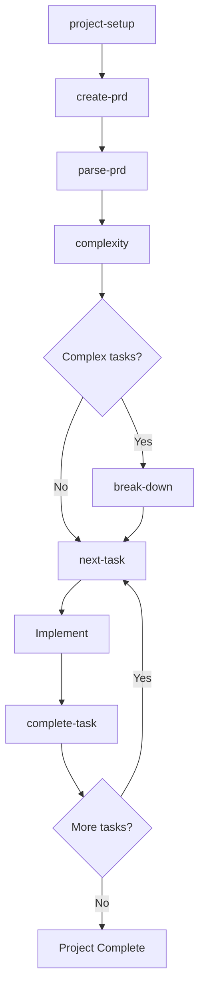
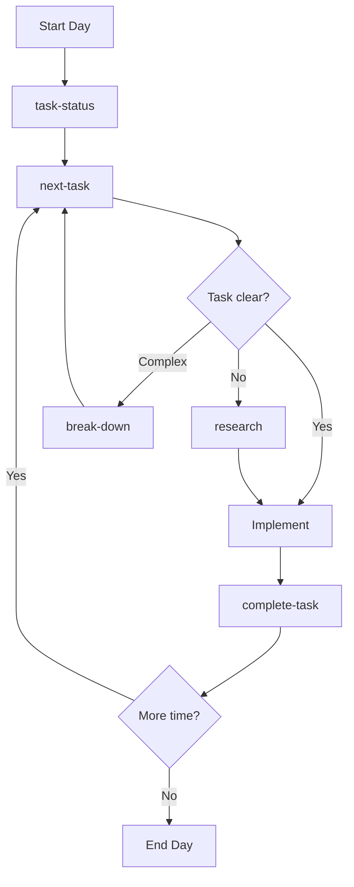
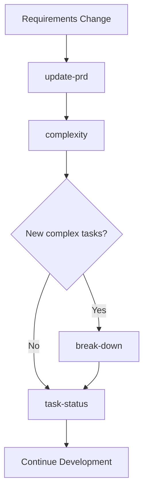
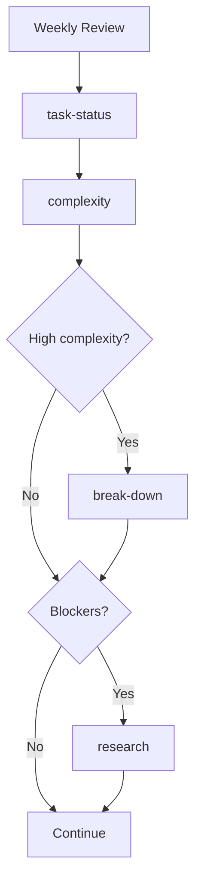

# Claude Code + TaskMaster Integration

IMPORTANT: This CLAUDE.md provides context for intelligent project management using TaskMaster AI. Claude should automatically understand TaskMaster commands and help users navigate the development workflow.

## 🎯 Context for Claude

**YOU MUST understand that this integration enables three interaction modes:**
1. **Direct MCP Commands**: `/project-setup`, `/next-task`, `/complexity` 
2. **Enhanced Commands**: `/research "topic"`, `/quick-task "description"`
3. **Natural Language**: Users can ask for project help in plain English

**IMPORTANT: When users ask project management questions, automatically suggest appropriate TaskMaster commands.**

TaskMaster AI provides comprehensive project management capabilities with AI-powered task generation, complexity analysis, and intelligent workflow optimization. The integration includes 12 essential commands that transform development workflows.

## 🚀 Essential Commands for Claude

**ALWAYS suggest these commands based on user context:**

### Initial Project Setup
```bash
/project-setup    # FIRST: Initialize TaskMaster and configure AI models
/create-prd      # SECOND: Create Product Requirements Document
/parse-prd       # THIRD: Generate structured tasks from PRD
```

### Daily Development Workflow  
```bash
/task-status     # Morning: Check project health and progress
/next-task       # Always: Get next priority task based on dependencies
/complete-task X # Finish: Mark task complete with validation
```

### Problem Solving & Analysis
```bash
/complexity      # When planning: Analyze task complexity and risks
/break-down X    # For complex tasks: Split into manageable subtasks
/research "topic" # For uncertainty: Get technical guidance and best practices
/quick-task "desc" # For urgent items: Add tasks quickly to backlog
```

**YOU MUST proactively suggest these commands when users express needs like:**
- "What should I work on?" → `/next-task`
- "This task is too complex" → `/break-down X`
- "How's my project going?" → `/task-status`
- "I need to research X" → `/research "X"`
- "I need to add a quick task" → `/quick-task "description"`

## ⚠️ Critical Guidelines for Claude

### Command Execution Rules
**YOU MUST follow these rules when suggesting commands:**

1. **ALWAYS use exact MCP syntax**: `mcp__taskmaster-ai__command_name`
2. **Required parameters**: Set `projectRoot` to current working directory
3. **Parameter validation**: Check required vs optional parameters before execution
4. **Error handling**: If command fails, suggest troubleshooting steps

### Development Workflow Principles
**IMPORTANT: Guide users through proper workflow:**

1. **Project Initialization**: Always start with `/project-setup` for new projects
2. **Requirements First**: Create PRD before generating tasks (`/create-prd` → `/parse-prd`)
3. **Complexity Analysis**: Run `/complexity` before starting development
4. **Task Breakdown**: Use `/break-down` for tasks rated 7+ complexity
5. **Research Integration**: Use `/research` for technical uncertainties
6. **Progress Monitoring**: Regular `/task-status` checks for project health

### Common Patterns to Recognize
**When users say...suggest:**
- "Starting new project" → `/project-setup`
- "Need to plan features" → `/create-prd`
- "Ready to start coding" → `/next-task`
- "Stuck on implementation" → `/research X`
- "Task seems overwhelming" → `/break-down X`
- "How's progress?" → `/task-status`
- "Found a bug" → `/quick-task "fix bug description"`

### Directory Structure Awareness
**YOU MUST understand TaskMaster creates:**
```
.taskmaster/
├── config.json              # Model configuration
├── docs/
│   ├── prd.txt              # Product Requirements
│   └── prd-backup-*.txt     # Version history
├── tasks/
│   ├── tasks.json           # Tasks database
│   └── task-*.md            # Individual task files
└── reports/
    └── complexity-*.json    # Analysis reports
```

## 📋 Command Reference

### 🏗️ Setup & Initialization Commands

#### `/project-setup`
**Purpose**: Complete project initialization and configuration
- Initializes TaskMaster project structure
- Configures AI models (main, research, fallback)
- Validates API keys and connectivity
- Creates necessary directories and templates
- **When to use**: First time setup, configuration issues

#### `/models`
**Purpose**: Manage AI model configuration and optimization
- Shows current model status and performance
- Provides cost and quality optimization recommendations
- Troubleshoots API connectivity issues
- **When to use**: Performance issues, cost optimization, model switching

### 📝 Requirements & Planning Commands

#### `/create-prd`
**Purpose**: Create comprehensive Product Requirements Document
- Interactive interview process for gathering requirements
- Generates structured PRD with user stories, technical specs
- Saves to `.taskmaster/docs/prd.txt`
- **When to use**: New project, major feature planning

#### `/update-prd`
**Purpose**: Update existing PRD and propagate changes
- Modifies existing requirements with change tracking
- Automatically updates affected tasks
- Maintains requirement history and impact analysis
- **When to use**: Scope changes, requirement updates

#### `/parse-prd`
**Purpose**: Convert PRD into structured, actionable tasks
- AI-powered analysis of requirements
- Generates tasks with priorities, dependencies, and estimates
- Creates logical task hierarchy and sequencing
- **When to use**: After PRD creation/updates, starting development

### 🎯 Daily Development Commands

#### `/task-status`
**Purpose**: Comprehensive project status dashboard
- Progress metrics and completion percentages
- Task distribution by status, priority, complexity
- Bottleneck identification and resolution suggestions
- **When to use**: Daily standups, progress reviews, planning

#### `/next-task`
**Purpose**: Intelligent next task recommendation
- Analyzes dependencies, priorities, and readiness
- Provides implementation guidance and approach
- Shows detailed task requirements and acceptance criteria
- **When to use**: Starting work sessions, picking next task

#### `/complete-task [id]`
**Purpose**: Validate and mark tasks complete
- Quality gate validation and acceptance criteria review
- Dependency updates and cascade effects
- Automatic next task suggestions
- **When to use**: Finishing task implementation

#### `/quick-task "description"`
**Purpose**: Rapidly add simple tasks to backlog
- AI-powered task creation from brief descriptions
- Automatic priority and complexity estimation
- Integration with existing project context
- **When to use**: Bug fixes, small improvements, urgent additions

### 🔍 Analysis & Optimization Commands

#### `/complexity`
**Purpose**: Project-wide complexity analysis and optimization
- Task complexity scoring (1-10 scale)
- Risk assessment and breakdown recommendations
- Sprint planning and resource allocation guidance
- **When to use**: Sprint planning, project health checks

#### `/break-down [id]`
**Purpose**: Split complex tasks into manageable subtasks
- Research-powered technical analysis
- Logical subtask creation with dependencies
- Effort estimation and parallel work identification
- **When to use**: Complex tasks (7+ complexity), unclear implementations

#### `/research [id|topic]`
**Purpose**: Technical research and best practice guidance
- Industry standard pattern analysis
- Tool and framework recommendations
- Security and performance considerations
- **When to use**: Technical uncertainty, architecture decisions

## 🔄 Development Pipelines

### 🚀 New Project Pipeline


### 📈 Daily Development Pipeline


### 🔄 Requirement Change Pipeline  


### 🧪 Quality Assurance Pipeline


## 🎨 Usage Patterns

### 🌅 Morning Routine
```bash
/task-status        # Check overnight changes and overall health
/next-task          # Get priority task for the day
# Optional: /research [id] if task needs investigation
```

### 🔄 Task Completion Flow
```bash
# When finishing a task
/complete-task 15   # Validate and mark complete
/next-task          # Get next priority automatically
```

### 🚨 Problem Resolution
```bash
# When stuck on complex task
/research 23        # Get technical guidance first
/break-down 23      # Split if still complex
/next-task          # Work on subtasks
```

### 📊 Planning Sessions
```bash
/complexity         # Understand project complexity
/task-status        # See current state
# Plan sprint based on insights
```

### ⚡ Quick Additions
```bash
/quick-task "Fix navbar alignment on mobile"
/quick-task "Add loading spinner to login button"
/quick-task "Update error message for invalid email"
```

## 🛠️ Integration Features

### AI Model Configuration
- **Main Model**: Primary task generation and analysis
- **Research Model**: Enhanced technical research and patterns
- **Fallback Model**: Reliability and cost optimization
- **Auto-switching**: Intelligent model selection based on task type

### Data Flow
```
PRD → Tasks → Subtasks → Implementation → Completion
 ↓      ↓        ↓           ↓             ↓
Research → Complexity → Dependencies → Progress → Metrics
```

### Quality Gates
- Task validation before completion
- Dependency verification
- Acceptance criteria checking
- Code quality suggestions
- Testing strategy recommendations

## 📊 Metrics & Analytics

### Project Health Indicators
- **Completion Rate**: Percentage of tasks completed
- **Velocity**: Tasks completed per time period  
- **Complexity Distribution**: Balance of simple vs complex tasks
- **Blocker Rate**: Percentage of blocked tasks
- **Breakdown Effectiveness**: Impact of task subdivision

### Optimization Opportunities
- **Task Sizing**: Optimal complexity distribution
- **Dependency Management**: Critical path optimization
- **Resource Allocation**: Skill-based task assignment
- **Risk Mitigation**: Early identification of problem areas

## 🔧 Configuration Files

### `.taskmaster/config.json`
```json
{
  "models": {
    "main": {
      "provider": "openai",
      "modelId": "o4-mini",
      "temperature": 0.2
    },
    "research": {
      "provider": "openai", 
      "modelId": "gpt-4o-mini-search-preview",
      "temperature": 0.1
    },
    "fallback": {
      "provider": "google",
      "modelId": "gemini-2.5-flash-preview-04-17", 
      "temperature": 0.2
    }
  }
}
```

### Directory Structure
```
.taskmaster/
├── config.json              # Model and project configuration
├── docs/
│   ├── prd.txt              # Product Requirements Document
│   └── prd-backup-*.txt     # PRD version history
├── tasks/
│   ├── tasks.json           # Main tasks database
│   └── task-*.md            # Individual task files
└── reports/
    └── complexity-*.json    # Complexity analysis reports
```

## 🚨 Critical Troubleshooting for Claude

**IMPORTANT: When TaskMaster commands fail, YOU MUST guide users through these solutions:**

### Initialization Issues
**"TaskMaster not initialized" → YOU MUST suggest:**
```bash
/project-setup  # ALWAYS start here for new projects
```

**"API key invalid" → YOU MUST suggest:**  
```bash
/models  # Check and configure model settings
```

### Task Management Issues
**"No tasks available" → YOU MUST guide through:**
```bash
/create-prd     # FIRST: Create requirements
/parse-prd      # SECOND: Generate tasks from PRD
/task-status    # THIRD: Verify tasks were created
```

**"Task too complex" → YOU MUST recommend:**
```bash
/break-down [id]  # Split into manageable subtasks
/research [id]    # Get implementation guidance
```

**"Dependency issues" → YOU MUST troubleshoot:**
```bash
/task-status  # Identify blocked tasks
# Guide user to resolve blocking tasks first
```

### Performance & Best Practices for Claude
**YOU MUST advise users:**
- Use research model sparingly for cost efficiency
- Break down complex tasks (7+ complexity) early
- Run regular `/complexity` analysis to prevent technical debt
- Monitor model performance with `/models`
- Maintain consistent project structure

### Command Parameter Guidelines for Claude
**CRITICAL: YOU MUST validate parameters:**
- `projectRoot`: ALWAYS set to current working directory
- Task IDs: MUST exist before referencing
- Descriptions: MUST be specific and actionable
- File paths: MUST be absolute paths when required

**Error Recovery Patterns YOU MUST follow:**
1. If MCP command fails → Check parameters and retry
2. If task not found → Run `/task-status` to list available tasks  
3. If dependency issues → Guide through dependency resolution
4. If model errors → Suggest `/models` configuration check

## 🎯 Success Metrics

Expected improvements after implementation:
- **40-60%** better task clarity and sizing
- **30-50%** reduction in blocked tasks
- **25-40%** improvement in estimate accuracy  
- **20-35%** increase in development velocity
- **Significant** improvement in project predictability

## 🤝 Contributing

When adding new functionality:
1. Update PRD with `/update-prd`
2. Analyze complexity with `/complexity`
3. Break down complex additions with `/break-down`
4. Use research for technical decisions `/research`
5. Follow established task completion flow

## 📚 Additional Resources

- **TaskMaster Documentation**: Core functionality and API reference
- **Claude Code Guide**: Integration patterns and best practices
- **Project Templates**: Starter PRDs and configurations
- **Workflow Examples**: Real-world usage patterns

## 🎯 Expected Claude Behavior

**WHEN THIS CLAUDE.md IS ACTIVE, YOU MUST:**

### 1. Proactive Command Suggestions
- Automatically suggest TaskMaster commands based on user context
- Guide users through proper workflow sequences
- Recognize project management needs and map to commands

### 2. Intelligent Command Execution  
- Use correct MCP syntax: `mcp__taskmaster-ai__command_name`
- Validate parameters before execution
- Handle errors gracefully with troubleshooting guidance

### 3. Project Context Awareness
- Understand TaskMaster project structure and files
- Recognize when projects need initialization
- Track project state and suggest appropriate next steps

### 4. Workflow Optimization
- Guide users through efficient development patterns
- Suggest breaking down complex tasks
- Recommend research for technical uncertainties
- Promote regular progress monitoring

**REMEMBER: This integration transforms Claude from a coding assistant into an intelligent project management partner. Always prioritize helping users maintain organized, efficient development workflows.**

---

**Ready to revolutionize your development workflow?** Start with `/project-setup`! 🚀

---

**Note: This CLAUDE.md file provides context for Claude Code to understand and effectively use TaskMaster AI integration. It should be placed in project roots or ~/.claude/ for automatic context loading.**