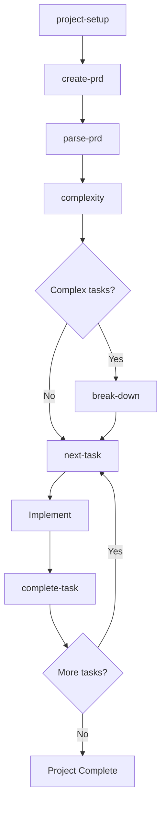
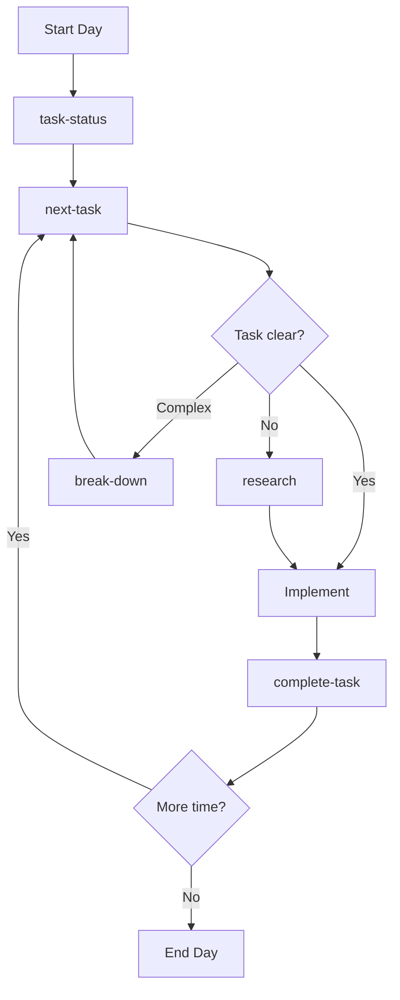
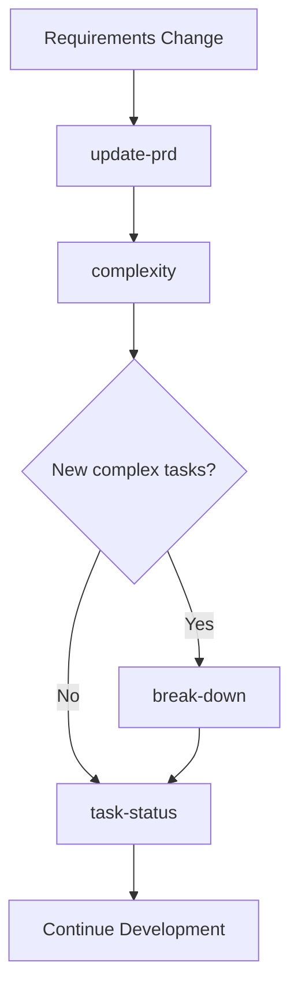
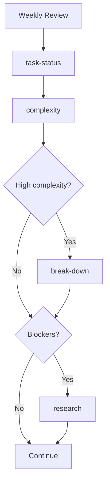
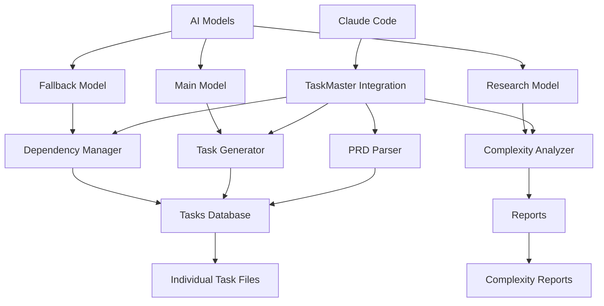
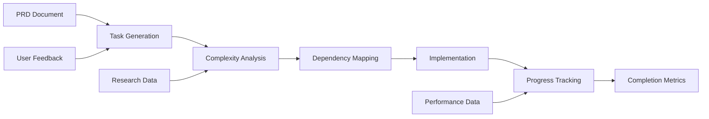

# Claude Code + TaskMaster AI Integration

🚀 **Revolutionary Development Workflow Automation**

Transform your development process with AI-powered project management, intelligent task generation, and automated workflow optimization.

[](https://opensource.org/licenses/MIT)
[](https://claude.ai/code)
[](https://github.com/eyaltoledano/claude-task-master)

## 🎯 What is This?

This integration combines **Claude Code** with **TaskMaster AI** to create a comprehensive development workflow system that includes:

- **12 Essential Slash Commands** for project management
- **AI-Powered Task Generation** from requirements
- **Intelligent Complexity Analysis** and task breakdown
- **Dependency Management** and workflow optimization
- **Research-Backed Development** guidance

## ⚡ Quick Start

### 1. Install Dependencies
```bash
# Install TaskMaster AI (if not already installed)
npm install -g @taskmaster/cli

# Copy commands to your global Claude directory
cp -r commands ~/.claude/
cp CLAUDE.md ~/.claude/
```

### 2. Initialize Your First Project
```bash
/project-setup    # Complete project setup
/create-prd      # Create requirements document
/parse-prd       # Generate structured tasks
/next-task       # Start development!
```

## 🎯 Three Ways to Use TaskMaster Integration

### 1️⃣ **Slash Commands** (Direct Execution)
```bash
/project-setup          # Initialize new TaskMaster project
/create-prd            # Start interactive PRD creation
/next-task             # Get next priority task
/complete-task 5       # Mark task 5 as complete
```

### 2️⃣ **Command + Query** (Enhanced Instructions)
```bash
/research "authentication best practices for React apps"
/quick-task "Add loading spinners to all form buttons"
/research 12 "focus on performance optimization"
/parse-prd --numTasks 15 "generate more granular tasks"
```

### 3️⃣ **Natural Language** (AI-Powered Understanding)
```bash
"Show me the project status and what I should work on next"
"Create a task for implementing user authentication"
"Help me research authentication patterns for my React app"
"I need to break down task 15 into smaller subtasks"
```

### 🚀 **When to Use Each Mode**

| Mode | Best For | Example Use Case | Limitations |
|------|----------|------------------|-------------|
| **Slash Commands** | Quick, direct actions | Daily workflow, known commands | None - direct MCP execution |
| **Command + Query** | Commands that accept parameters | Research topics, task descriptions | Limited to specific commands |
| **Natural Language** | Conversational interaction | Planning, exploration, guidance | Depends on Claude Code interpretation |

> **✨ Smart Context Integration**: The CLAUDE.md integration enables Claude Code to understand TaskMaster context automatically. Natural language requests are interpreted and mapped to appropriate MCP commands when possible.

> **⚠️ Note**: Command + Query syntax works only for commands that explicitly accept parameters. Natural language effectiveness depends on Claude Code's ability to interpret your intent and map it to the correct TaskMaster operations.

### 🎯 **Usage Flexibility Examples**

**All these achieve the same result:**
```bash
# Slash Command
/task-status

# Natural Language  
"What's the current project status?"

# Mixed Approach
"Show me /task-status and suggest what to work on next"
```

**Research with different approaches:**
```bash
# Direct Command
/research "React state management"

# Task-Specific Research
/research 15

# Natural Language
"I need help with state management patterns for React applications"
```

### 📋 **Command Compatibility Guide**

**✅ Commands that accept queries/parameters:**
- `/research "topic"` or `/research taskId`
- `/quick-task "description"`
- `/parse-prd --numTasks X`
- `/complete-task taskId`

**⚠️ Commands with limited parameters:**
- `/break-down taskId` (no additional text)
- `/task-status` (no parameters)
- `/next-task` (no parameters)
- `/complexity` (no parameters)

**🤖 Natural language works best for:**
- Project planning and exploration
- Getting guidance and explanations
- Understanding task relationships
- Learning about TaskMaster features

### 💡 **Best Practices & Tips**

**🎯 For Maximum Efficiency:**
```bash
# Start with slash commands for daily workflow
/task-status → /next-task → [work] → /complete-task X

# Use research for complex decisions
/research "database migration patterns"
/research 23  # Research specific task

# Natural language for exploration
"What should I focus on this week?"
"How does task complexity affect my timeline?"
```

**⚠️ Common Pitfalls:**
- Don't assume all commands accept additional text parameters
- Natural language requires clear, specific requests
- Some operations require multiple commands (setup → research → breakdown)
- Task IDs must exist before referencing them

**🔄 Recommended Workflow:**
1. **Setup Phase**: Use direct commands (`/project-setup`, `/create-prd`)
2. **Planning Phase**: Mix natural language with targeted research
3. **Development Phase**: Primarily slash commands for speed
4. **Problem Solving**: Natural language + research commands

## 📋 Available Commands

### 🏗️ **Setup & Configuration**
- `/project-setup` - Complete project initialization
- `/models` - Configure AI models and API keys

### 📝 **Requirements & Planning**
- `/create-prd` - Interactive requirements gathering
- `/update-prd` - Update existing requirements
- `/parse-prd` - Generate tasks from requirements

### 🎯 **Daily Development**
- `/task-status` - Project health dashboard
- `/next-task` - Get next priority task
- `/complete-task [id]` - Mark tasks complete
- `/quick-task "description"` - Add quick tasks

### 🔍 **Analysis & Optimization**
- `/complexity` - Project complexity analysis
- `/break-down [id]` - Split complex tasks
- `/research [id|topic]` - Technical research

## 🔄 Development Workflows

### 🚀 **New Project Workflow**


### 📈 **Daily Development Pipeline**


### 🔄 **Requirement Change Pipeline**


### 🧪 **Quality Assurance Pipeline**


## 🛠️ Installation & Setup

### 📋 **Prerequisites**

**Required Dependencies:**
```bash
# 1. Node.js (for Claude Code CLI)
# macOS:
brew install node

# Ubuntu/Debian:
sudo apt install nodejs npm

# Windows:
# Download from https://nodejs.org

# 2. Claude Code CLI
npm install -g @anthropic-ai/claude-code

# 3. Verify installation
claude --version
```

**Optional (but recommended):**
- OpenAI API key for enhanced AI models
- Anthropic API key for Claude models
- Google API key for Gemini models

### 🚀 **Automated Installation** (Recommended)
```bash
# Clone this repository
git clone https://github.com/raphaelchristi/claude-taskmaster-integration
cd claude-taskmaster-integration

# Interactive installation (choose global/local/both)
./install.sh

# Or use direct options:
./install.sh --global    # Install globally (~/.claude/)
./install.sh --local     # Install locally (current project)
./install.sh --both      # Install both globally and locally
./install.sh --help      # Show all options
```

> **✨ The install script automatically:**
> - Checks for Node.js and npm
> - Installs Claude Code CLI if missing (`npm install -g @anthropic-ai/claude-code`)
> - Creates necessary directory structure
> - Provides guidance for API key configuration

### 📋 **Installation Types**

| Type | Command | Best For | Location |
|------|---------|----------|----------|
| **Global** | `./install.sh --global` | Daily use across all projects | `~/.claude/` |
| **Local** | `./install.sh --local` | Project-specific customization | `./commands/`, `./CLAUDE.md` |
| **Both** | `./install.sh --both` | Global access + local customization | Both locations |

### 🔧 **Manual Installation**
```bash
# Global installation
cp -r commands ~/.claude/
cp CLAUDE.md ~/.claude/

# Local installation  
cp -r commands ./
cp CLAUDE.md ./

# Verify installation
/project-setup --help
```

## 📚 Documentation

- **[CLAUDE.md](./CLAUDE.md)** - Complete integration guide
- **[Commands Reference](./commands/README.md)** - Detailed command documentation
- **[Examples](./examples/)** - Real-world usage examples
- **[Troubleshooting](./docs/troubleshooting.md)** - Common issues and solutions

## 🎨 Usage Examples

### Creating a New Web App
```bash
/project-setup
# → Initializes TaskMaster structure

/create-prd
# → Interactive interview for requirements
# → Saves comprehensive PRD

/parse-prd
# → Generates 15-20 structured tasks
# → Sets priorities and dependencies

/complexity
# → Identifies 3 complex tasks needing breakdown

/break-down 7
# → Splits complex authentication task into 5 subtasks

/next-task
# → Suggests: "Set up project structure and dependencies"
```

### Daily Development Flow
```bash
/task-status
# → Shows: 15 tasks total, 8 completed, 2 in progress

/next-task
# → Recommends: Task #12 - "Implement user login form"
# → Shows requirements, acceptance criteria, approach

# ... implement the task ...

/complete-task 12
# → Validates completion
# → Updates dependencies
# → Suggests next task automatically
```

## 🌟 Key Features

### 🏗️ **System Architecture**


### 📊 **Data Flow Pipeline**


### ✨ **AI-Powered Intelligence**
- Automatic task generation from requirements
- Intelligent complexity scoring (1-10 scale)
- Research-backed technical recommendations
- Context-aware dependency management

### 🎯 **Workflow Optimization**
- Smart task prioritization
- Bottleneck identification
- Parallel work opportunities
- Progress tracking and metrics

### 🔧 **Developer Experience**
- Natural language commands
- Slash command shortcuts
- Real-time project health monitoring
- Comprehensive documentation

## 📊 Performance Benefits

Expected improvements after implementation:
- **40-60%** better task clarity and sizing
- **30-50%** reduction in blocked tasks  
- **25-40%** improvement in estimate accuracy
- **20-35%** increase in development velocity

## 🔧 Configuration

### Model Configuration
```json
{
  "models": {
    "main": {
      "provider": "openai",
      "modelId": "o4-mini",
      "temperature": 0.2
    },
    "research": {
      "provider": "openai",
      "modelId": "gpt-4o-mini-search-preview", 
      "temperature": 0.1
    },
    "fallback": {
      "provider": "google",
      "modelId": "gemini-2.5-flash-preview-04-17",
      "temperature": 0.2
    }
  }
}
```

### Directory Structure
```
.taskmaster/
├── config.json              # Model configuration
├── docs/
│   ├── prd.txt              # Product Requirements
│   └── prd-backup-*.txt     # Version history
├── tasks/
│   ├── tasks.json           # Tasks database
│   └── task-*.md            # Individual task files
└── reports/
    └── complexity-*.json    # Analysis reports
```

## 🤝 Contributing

We welcome contributions! Please see our [Contributing Guide](./CONTRIBUTING.md) for details.

### Development Setup
```bash
git clone https://github.com/yourusername/claude-taskmaster-integration
cd claude-taskmaster-integration
npm install
npm run dev
```

## 📄 License

This project is licensed under the MIT License - see the [LICENSE](./LICENSE) file for details.

## 🙏 Acknowledgments

- **Anthropic** for Claude Code
- **[TaskMaster AI](https://github.com/eyaltoledano/claude-task-master)** for the core task management engine
- **Open Source Community** for inspiration and feedback

## 📞 Support

- 📚 [Documentation](./CLAUDE.md)
- 🐛 [Issue Tracker](https://github.com/raphaelchristi/claude-taskmaster-integration/issues)
- 💬 [Discussions](https://github.com/raphaelchristi/claude-taskmaster-integration/discussions)
- 📧 [Email Support](mailto:raphael.christi@example.com)

---

**Ready to revolutionize your development workflow?** 

🚀 **Start with `/project-setup` and experience the future of AI-powered development!**

---

[](https://github.com/raphaelchristi/claude-taskmaster-integration)
[](https://github.com/raphaelchristi/claude-taskmaster-integration/fork)