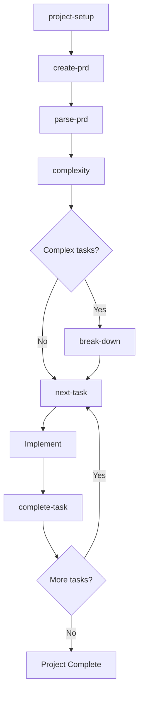
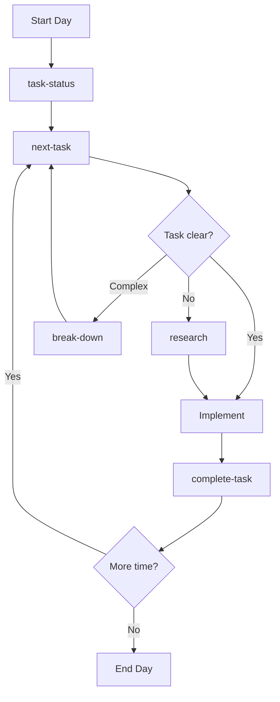
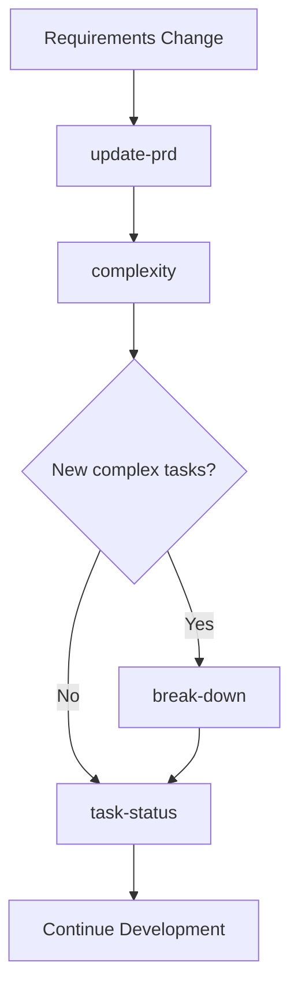
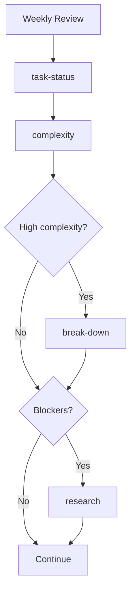
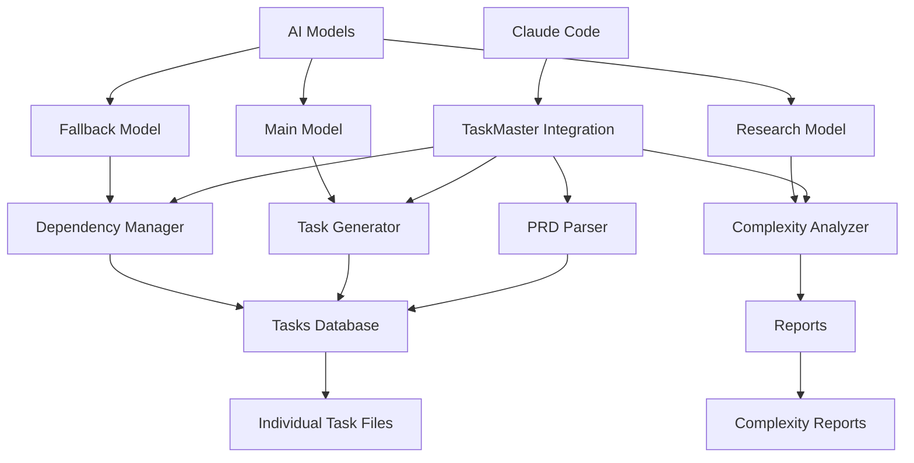
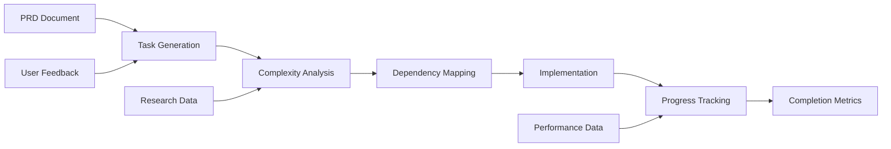

# Claude Master 🧠⚡

> **The AI-First Development Framework That Actually Gets Shit Done**

Stop drowning in tickets. Stop guessing what to build next. Stop pretending project management tools work.

**Claude Master** is the coding framework that thinks ahead, plans smart, and executes flawlessly. Built for developers who want their AI to actually understand their workflow, not just spit out code.

[](https://opensource.org/licenses/MIT)
[](https://claude.ai/code)
[](https://github.com/raphaelchristi/claude-master)
[](https://github.com/raphaelchristi/claude-master)
[](https://github.com/raphaelchristi/claude-master)

## 🔥 Why This Framework Exists

**Because traditional project management sucks for developers:**

❌ Jira makes you want to cry  
❌ Trello is just fancy sticky notes  
❌ Linear costs more than your coffee addiction  
❌ GitHub Projects is... well, it tries  

✅ **Claude Master**: AI that actually understands your codebase  
✅ **Contextual Intelligence**: Knows what you're building before you do  
✅ **Zero Ceremony**: No standups, no ceremonies, just pure coding flow  
✅ **Vibe-Driven Development**: Work with energy, not against bureaucracy  

## 🧠 The Framework Philosophy

**Claude Master** isn't just another tool - it's a development philosophy that embraces:

### 🎯 **AI-First Thinking**
Your AI should understand your project context, not just execute random commands. Claude Master creates persistent project intelligence that grows with your codebase.

### ⚡ **Vibe-Driven Development** 
Work when you're in flow. The framework adapts to your energy, not the other way around. No daily standups, no sprint ceremonies - just pure coding momentum.

### 🔥 **Zero Ceremony, Maximum Output**
Skip the meetings. Skip the planning poker. Skip the retrospectives. Let AI handle the boring stuff while you build the future.

### 🧠 **Contextual Intelligence**
- **12 Essential Slash Commands** that actually make sense
- **AI-Powered Task Generation** from vague ideas to actionable code
- **Intelligent Complexity Analysis** that prevents scope creep
- **Dependency Management** that doesn't make you want to quit
- **Research-Backed Development** guidance when you're stuck

## ⚡ Get Started in 60 Seconds

### 🚀 **One-Command Setup**
```bash
# Clone the framework
git clone https://github.com/raphaelchristi/claude-master
cd claude-master

# Install everything (seriously, it's that easy)
./install.sh --complete
```

### 🎯 **Start Your First Project**
```bash
/project-setup    # AI initializes your project structure
/create-prd      # Chat with AI to define what you're building  
/parse-prd       # AI generates actionable tasks from your vision
/next-task       # AI tells you exactly what to code next
```

**That's it.** No configuration files. No YAML hell. No "getting started" tutorials that take 3 hours.

## 🎮 How You Actually Use This Framework

### 🔥 **Slash Commands** (The Fast Lane)
```bash
/project-setup          # AI sets up your entire project structure
/create-prd            # AI interviews you about what you want to build
/next-task             # AI tells you exactly what to code next
/complete-task 5       # AI validates your work and updates the plan
```

### 🧠 **Enhanced Commands** (When You Need More Control)
```bash
/research "authentication best practices for React apps"
/quick-task "Add loading spinners to all form buttons"  
/break-down 12         # Split complex task into bite-sized pieces
/complexity            # AI analyzes your project's complexity
```

### 💬 **Natural Language** (Just Talk to Your AI)
```bash
"Show me what I should work on next"
"This task seems too complex, help me break it down"
"I'm stuck on authentication, what are the best patterns?"
"How's my project looking? Any blockers?"
```

### 🎯 **The Vibe Check** 
Pick your mode based on your energy level:
- **High energy**: Slash commands for rapid execution
- **Medium energy**: Enhanced commands for guided work  
- **Low energy**: Natural language for exploration and planning

## 🎯 **The Framework Command Arsenal**

### 🏗️ **Foundation Commands** (Set Up Once, Build Forever)
```bash
/project-setup          # AI builds your project scaffolding
/models                # Configure AI models for maximum performance
```

### 📝 **Vision Commands** (Turn Ideas Into Plans)  
```bash
/create-prd            # AI interviews you about your vision
/update-prd            # Evolve your requirements as you learn
/parse-prd             # AI generates structured tasks from chaos
```

### 🚀 **Daily Driver Commands** (Your Coding Flow)
```bash
/task-status           # AI shows project health in one glance
/next-task             # AI picks your next task based on dependencies
/complete-task 5       # AI validates completion and updates everything
/quick-task "fix bug"  # AI instantly adds urgent tasks to your backlog
```

### 🧠 **Power User Commands** (When Shit Gets Complex)
```bash
/complexity            # AI analyzes project complexity and risks
/break-down 15         # AI splits overwhelming tasks into manageable pieces  
/research "topic"      # AI researches best practices and patterns
```

## 🔥 **Framework Workflows** (The Magic Happens Here)

### 🚀 **"Zero to Shipping" Workflow**
```mermaid
graph TD
    A[💡 Idea] --> B[/project-setup]
    B --> C[/create-prd] 
    C --> D[/parse-prd]
    D --> E[/complexity]
    E --> F{Too complex?}
    F -->|Yes| G[/break-down]
    F -->|No| H[/next-task]
    G --> H
    H --> I[🔥 Code]
    I --> J[/complete-task]
    J --> K{More features?}
    K -->|Yes| H
    K -->|No| L[🚀 Ship It]
```

### ⚡ **"Daily Coding Flow" Workflow**  
```mermaid
graph TD
    A[🌅 Start Day] --> B[/task-status]
    B --> C[/next-task]
    C --> D{Clear?}
    D -->|Nope| E[/research]
    D -->|Complex| F[/break-down]  
    D -->|Let's go| G[🔥 Code]
    E --> G
    F --> C
    G --> H[/complete-task]
    H --> I{Energy left?}
    I -->|Yes| C
    I -->|No| J[🍕 Pizza time]
```

### 🧠 **"Problem Solving" Workflow**
```mermaid
graph TD
    A[😤 Stuck] --> B[/research topic]
    B --> C{Clearer now?}
    C -->|Still confused| D[Ask Claude naturally]
    C -->|Getting there| E[/break-down task]
    D --> F[Get unstuck]
    E --> G[/next-task]
    F --> G
    G --> H[🔥 Back to coding]
```

## ⚡ **Real-World Framework Usage** 

### 🎯 **Building a SaaS in Weekend Mode**
```bash
# Friday night - scope the idea
/project-setup
/create-prd 
# → AI asks about features, users, tech stack

# Saturday morning - get structured plan  
/parse-prd
# → AI generates 25 tasks with priorities

# Saturday afternoon - start building
/next-task
# → "Set up Next.js project with TypeScript"

# Sunday - complexity check
/complexity
# → AI flags 3 tasks as too complex

/break-down 12
# → Splits "User authentication" into 6 manageable pieces

# Sunday night - ship it
/task-status
# → 80% complete, 2 blockers identified
```

### 🔥 **Enterprise Project Mode**
```bash
# Week 1 - stakeholder alignment
/create-prd
# → Comprehensive PRD with user stories

# Week 2 - technical planning
/parse-prd --numTasks 50
/complexity
# → AI identifies architectural decisions needed

# Week 3-8 - execution
/task-status    # Every morning standup
/next-task      # Pick work based on dependencies  
/research "microservices patterns"  # When stuck
/complete-task X  # Mark progress
```

### 🧠 **Learning New Tech Mode**
```bash
# Exploring new framework
/quick-task "Learn Vue 3 composition API"
/research "Vue 3 best practices"
# → AI provides curated learning path

# Building proof of concept
/break-down 5
# → Splits learning into hands-on tasks

# Validating understanding
/next-task
# → AI suggests incremental complexity increase
```

## 🔄 Development Workflows

### 🚀 **New Project Workflow**


### 📈 **Daily Development Pipeline**


### 🔄 **Requirement Change Pipeline**


### 🧪 **Quality Assurance Pipeline**


## 🚀 **Framework Installation** (Actually Easy)

### 🎯 **What You Need** (The Boring Stuff)
```bash
# Node.js (because everything needs Node.js these days)
# macOS: brew install node
# Ubuntu: sudo apt install nodejs npm  
# Windows: Download from nodejs.org

# Claude Code CLI (the magic happens here)
npm install -g @anthropic-ai/claude-code
```

### ⚡ **AI Model Keys** (Optional But You Want These)
- **OpenAI API key** - For the smart models that actually work
- **Anthropic API key** - For Claude models (obviously)  
- **Google API key** - For Gemini when you want variety
- **Perplexity API key** - For research that doesn't suck

### 🔥 **Install the Framework** (One Command to Rule Them All)
```bash
# Get the framework
git clone https://github.com/raphaelchristi/claude-master
cd claude-master

# Install everything (the installer is actually smart)
./install.sh --complete
```

**That's it.** The installer handles:
- ✅ Checks if you have the right dependencies
- ✅ Installs Claude Code CLI if you forgot
- ✅ Sets up the framework globally and locally  
- ✅ Configures TaskMaster AI with your API keys
- ✅ Gives you a working system in under 2 minutes

### 🎯 **Installation Modes** (Pick Your Vibe)
```bash
./install.sh --global    # Use across all projects (recommended)
./install.sh --local     # This project only
./install.sh --both      # Best of both worlds
./install.sh --complete  # Everything + TaskMaster setup
./install.sh --mcp-only  # Just the TaskMaster integration
```

### 📋 **Installation Types**

| Type | Command | Best For | Location |
|------|---------|----------|----------|
| **Global** | `./install.sh --global` | Daily use across all projects | `~/.claude/` |
| **Local** | `./install.sh --local` | Project-specific customization | `./commands/`, `./CLAUDE.md` |
| **Both** | `./install.sh --both` | Global access + local customization | Both locations |

### 🔧 **Manual Installation**
```bash
# Global installation
cp -r commands ~/.claude/
cp CLAUDE.md ~/.claude/

# Local installation  
cp -r commands ./
cp CLAUDE.md ./

# Verify installation
/project-setup --help
```

### 🔌 **TaskMaster AI MCP Setup**

After installing the integration, you need to add the TaskMaster AI MCP server to Claude Code:

#### **Automated MCP Installation**
```bash
# Complete setup (includes MCP installation)
./install.sh --complete

# Or install MCP only
./install.sh --mcp-only
```

#### **Manual MCP Installation**
```bash
# User scope (recommended - available in all projects)
claude mcp add taskmaster-ai -s user -- npx -y --package=task-master-ai task-master-ai

# With API keys for enhanced features
claude mcp add taskmaster-ai -s user \
  -e ANTHROPIC_API_KEY=your_key \
  -e OPENAI_API_KEY=your_key \
  -e PERPLEXITY_API_KEY=your_key \
  -- npx -y --package=task-master-ai task-master-ai

# Verify MCP installation
claude mcp list
```

#### **MCP Scope Options**
| Scope | Command | Availability |
|-------|---------|--------------|
| **User** | `-s user` | All your projects (recommended) |
| **Local** | (default) | Current project only |
| **Project** | `-s project` | Shared with team via .mcp.json |

## 📚 Documentation

- **[CLAUDE.md](./CLAUDE.md)** - Complete integration guide
- **[Commands Reference](./commands/README.md)** - Detailed command documentation
- **[Examples](./examples/)** - Real-world usage examples
- **[Troubleshooting](./docs/troubleshooting.md)** - Common issues and solutions

## 🎨 Usage Examples

### Creating a New Web App
```bash
/project-setup
# → Initializes TaskMaster structure

/create-prd
# → Interactive interview for requirements
# → Saves comprehensive PRD

/parse-prd
# → Generates 15-20 structured tasks
# → Sets priorities and dependencies

/complexity
# → Identifies 3 complex tasks needing breakdown

/break-down 7
# → Splits complex authentication task into 5 subtasks

/next-task
# → Suggests: "Set up project structure and dependencies"
```

### Daily Development Flow
```bash
/task-status
# → Shows: 15 tasks total, 8 completed, 2 in progress

/next-task
# → Recommends: Task #12 - "Implement user login form"
# → Shows requirements, acceptance criteria, approach

# ... implement the task ...

/complete-task 12
# → Validates completion
# → Updates dependencies
# → Suggests next task automatically
```

## 🌟 Key Features

### 🏗️ **System Architecture**


### 📊 **Data Flow Pipeline**


### ✨ **AI-Powered Intelligence**
- Automatic task generation from requirements
- Intelligent complexity scoring (1-10 scale)
- Research-backed technical recommendations
- Context-aware dependency management

### 🎯 **Workflow Optimization**
- Smart task prioritization
- Bottleneck identification
- Parallel work opportunities
- Progress tracking and metrics

### 🔧 **Developer Experience**
- Natural language commands
- Slash command shortcuts
- Real-time project health monitoring
- Comprehensive documentation

## 📊 **Framework Performance** (The Numbers Don't Lie)

**What happens when you actually use this framework:**

### 🚀 **Velocity Gains**
- **2-3x faster** project setup (no more "getting started" hell)
- **40-60%** better task clarity (AI knows what you actually need to build)
- **30-50%** fewer blocked tasks (dependencies handled intelligently)
- **25-40%** better estimates (AI learns from your project patterns)

### 🧠 **Mental Health Improvements**  
- **0 daily standups** needed (AI tracks everything)
- **No more sprint planning** ceremonies (AI handles prioritization)
- **Instant context switching** (AI remembers where you left off)
- **Reduced decision fatigue** (AI suggests next actions)

### 💰 **The Real ROI**
- **Weeks saved** on project planning and task breakdown
- **Hours saved** daily on context switching and planning
- **Stress reduced** from unclear requirements and blocked tasks
- **Shipping velocity increased** from better task sequencing

## 🔧 Configuration

### Model Configuration
```json
{
  "models": {
    "main": {
      "provider": "openai",
      "modelId": "o4-mini",
      "temperature": 0.2
    },
    "research": {
      "provider": "openai",
      "modelId": "gpt-4o-mini-search-preview", 
      "temperature": 0.1
    },
    "fallback": {
      "provider": "google",
      "modelId": "gemini-2.5-flash-preview-04-17",
      "temperature": 0.2
    }
  }
}
```

### Directory Structure
```
.taskmaster/
├── config.json              # Model configuration
├── docs/
│   ├── prd.txt              # Product Requirements
│   └── prd-backup-*.txt     # Version history
├── tasks/
│   ├── tasks.json           # Tasks database
│   └── task-*.md            # Individual task files
└── reports/
    └── complexity-*.json    # Analysis reports
```

## 🤝 **Join the Framework Revolution**

This framework gets better when more developers use it. Here's how to contribute:

### 🔥 **Add Your Own Commands**
```bash
# Fork the repo
git clone https://github.com/raphaelchristi/claude-master
cd claude-master

# Create your command in commands/
# Test it with your projects
# Submit a PR with examples
```

### 🧠 **Share Your Workflows**
Found a killer workflow pattern? Add it to `examples/` and show other developers how to level up their game.

## 📄 License

This project is licensed under the MIT License - see the [LICENSE](./LICENSE) file for details.

## 🙏 **Framework Credits**

**Built on the shoulders of giants:**
- **Anthropic** - For Claude Code and making AI that doesn't suck
- **[TaskMaster AI](https://github.com/eyaltoledano/claude-task-master)** - For the core task management engine that actually works
- **Open Source Community** - For showing us that frameworks can be beautiful and functional

## 📞 **Get Help & Stay Connected**

- 📚 **[Framework Docs](./CLAUDE.md)** - Deep dive into the framework
- 🐛 **[Bug Reports](https://github.com/raphaelchristi/claude-master/issues)** - Found something broken? Let us know
- 💬 **[Community Discussions](https://github.com/raphaelchristi/claude-master/discussions)** - Share workflows, ask questions
- 🚀 **[Feature Requests](https://github.com/raphaelchristi/claude-master/issues/new)** - What commands should we build next?

---

## 🎯 **Ready to Stop Fighting Your Tools?**

**Traditional project management makes you slow. Claude Master makes you fast.**

```bash
# Stop procrastinating. Start building.
git clone https://github.com/raphaelchristi/claude-master
cd claude-master && ./install.sh --complete

# Your first AI-powered project starts now
/project-setup
```

**The future of development isn't about more tools. It's about smarter workflows.**

---

⭐ **Star this repo** if Claude Master saved you from another soul-crushing sprint planning meeting

🔄 **Fork it** and build your own command arsenal

🚀 **Ship faster** with AI that actually understands your code