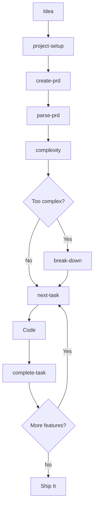
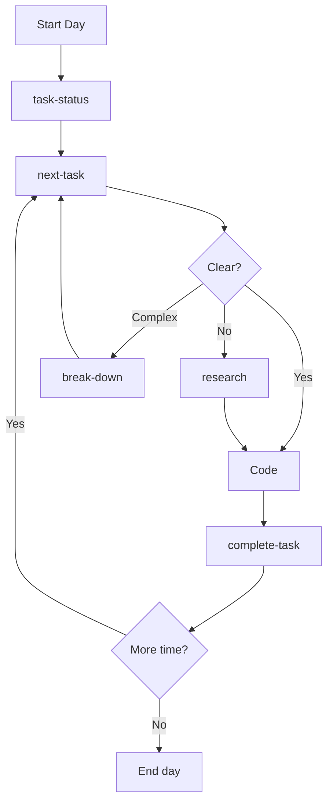
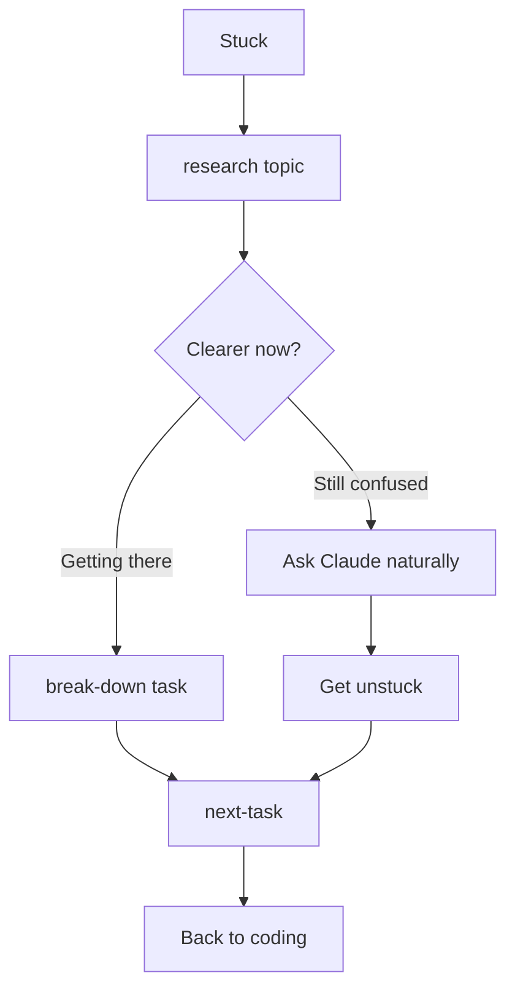
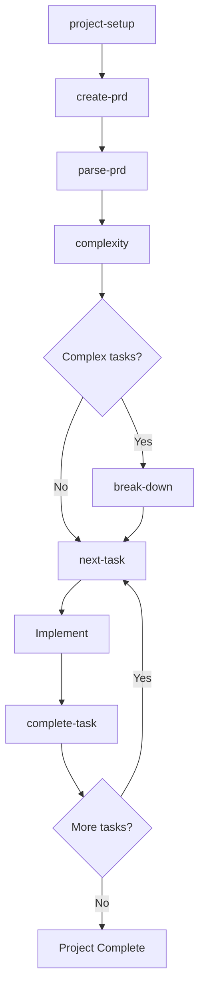
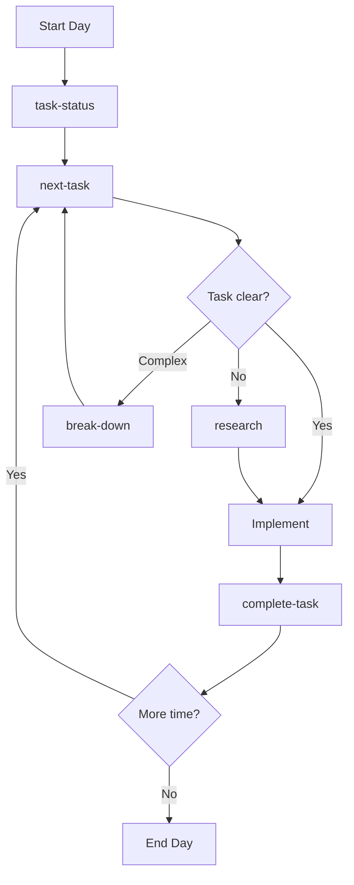
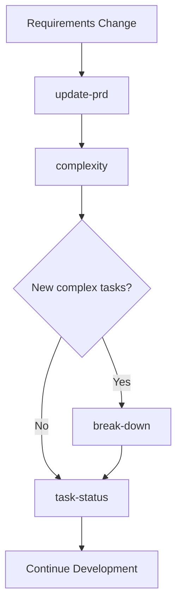
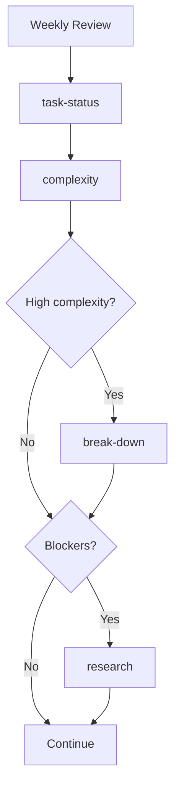
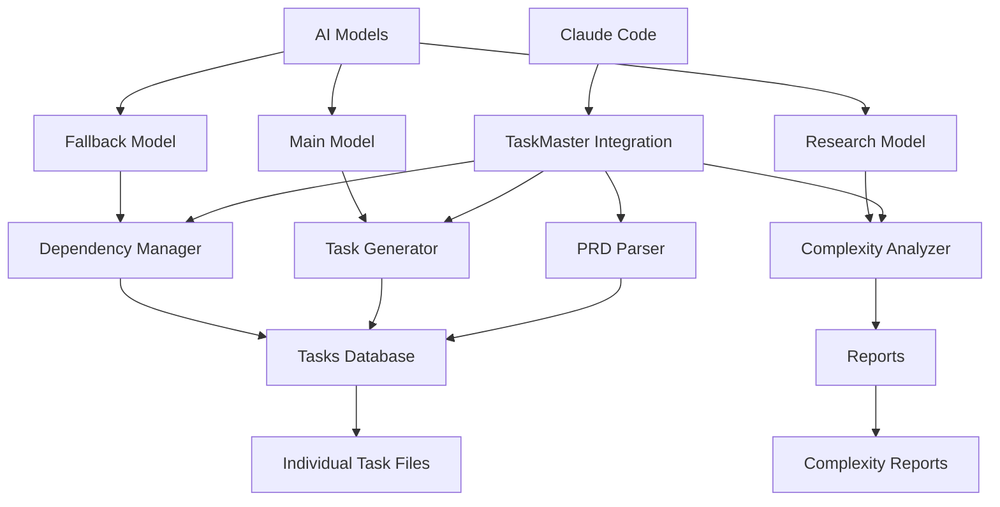
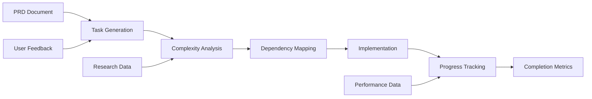

# Claude Master 🧠⚡

> **The AI-First Development Framework That Actually Gets Shit Done**

Stop drowning in tickets. Stop guessing what to build next. Stop pretending project management tools work.

**Claude Master** is the coding framework that thinks ahead, plans smart, and executes flawlessly. Built for developers who want their AI to actually understand their workflow, not just spit out code.

[](https://opensource.org/licenses/MIT)
[](https://claude.ai/code)
[](https://github.com/raphaelchristi/claude-master)
[](https://github.com/raphaelchristi/claude-master)
[](https://github.com/raphaelchristi/claude-master)

## What This Framework Solves

**Claude Master** addresses the core challenges developers face with project management:

**Context Loss**: Traditional tools don't understand your codebase or technical decisions  
**Task Ambiguity**: Tickets that say "implement auth" without breaking down the actual work  
**Dependency Hell**: Blocked tasks and unclear sequencing that kills momentum  
**Research Overhead**: Constantly context-switching between coding and researching best practices  

**Claude Master provides:**
- **Contextual Intelligence**: AI that understands your project structure and technical context
- **Intelligent Task Breakdown**: Complex features automatically split into manageable, sequential tasks  
- **Research Integration**: On-demand technical guidance without leaving your development flow
- **Dependency Management**: Clear task sequencing based on actual technical dependencies

## Framework Philosophy

**Claude Master** is built around three core principles:

### AI-First Development
Your development tools should understand your project context, not just execute isolated commands. Claude Master creates persistent project intelligence that evolves with your codebase.

### Contextual Intelligence
- 12 essential commands that integrate with your project structure
- AI-powered task generation from requirements to actionable code
- Intelligent complexity analysis that prevents scope creep
- Dependency management based on actual technical relationships
- Research-backed development guidance contextual to your stack

## Quick Start

### One-Command Setup
```bash
# Clone the framework
git clone https://github.com/raphaelchristi/claude-master
cd claude-master

# Install everything
./install.sh --complete
```

### Start Your First Project
```bash
/project-setup    # AI initializes your project structure
/create-prd      # Chat with AI to define what you're building  
/parse-prd       # AI generates actionable tasks from your vision
/next-task       # AI tells you exactly what to code next
```

**That's it.** No configuration files. No complex setup. No lengthy tutorials.

## How You Use This Framework

### Slash Commands (Direct Execution)
```bash
/project-setup          # AI sets up your entire project structure
/create-prd            # AI interviews you about what you want to build
/next-task             # AI tells you exactly what to code next
/complete-task 5       # AI validates your work and updates the plan
```

### Enhanced Commands (With Parameters)
```bash
/research "authentication best practices for React apps"
/quick-task "Add loading spinners to all form buttons"  
/break-down 12         # Split complex task into manageable pieces
/complexity            # AI analyzes your project's complexity
```

### Natural Language (Conversational)
```bash
"Show me what I should work on next"
"This task seems too complex, help me break it down"
"I'm stuck on authentication, what are the best patterns?"
"How's my project looking? Any blockers?"
```

### Usage Modes
Pick your interaction style based on the situation:
- **Direct commands**: For rapid execution of known actions
- **Enhanced commands**: For commands that need specific parameters  
- **Natural language**: For exploration, planning, and guidance

## Framework Commands

### Foundation Commands
```bash
/project-setup          # AI builds your project scaffolding
/models                # Configure AI models for performance
```

### Planning Commands
```bash
/create-prd            # AI interviews you about your vision
/update-prd            # Evolve your requirements as you learn
/parse-prd             # AI generates structured tasks from requirements
```

### Daily Development Commands
```bash
/task-status           # AI shows project health at a glance
/next-task             # AI picks your next task based on dependencies
/complete-task 5       # AI validates completion and updates everything
/quick-task "fix bug"  # AI instantly adds urgent tasks to your backlog
```

### Analysis Commands
```bash
/complexity            # AI analyzes project complexity and risks
/break-down 15         # AI splits complex tasks into manageable pieces  
/research "topic"      # AI researches best practices and patterns
```

## Framework Workflows

### "Zero to Shipping" Workflow


### "Daily Coding Flow" Workflow  


### "Problem Solving" Workflow


## Real-World Framework Usage 

### Building a SaaS in Weekend Mode
```bash
# Friday night - scope the idea
/project-setup
/create-prd 
# → AI asks about features, users, tech stack

# Saturday morning - get structured plan  
/parse-prd
# → AI generates 25 tasks with priorities

# Saturday afternoon - start building
/next-task
# → "Set up Next.js project with TypeScript"

# Sunday - complexity check
/complexity
# → AI flags 3 tasks as too complex

/break-down 12
# → Splits "User authentication" into 6 manageable pieces

# Sunday night - ship it
/task-status
# → 80% complete, 2 blockers identified
```

### Enterprise Project Mode
```bash
# Week 1 - stakeholder alignment
/create-prd
# → Comprehensive PRD with user stories

# Week 2 - technical planning
/parse-prd --numTasks 50
/complexity
# → AI identifies architectural decisions needed

# Week 3-8 - execution
/task-status    # Every morning standup
/next-task      # Pick work based on dependencies  
/research "microservices patterns"  # When stuck
/complete-task X  # Mark progress
```

### Learning New Tech Mode
```bash
# Exploring new framework
/quick-task "Learn Vue 3 composition API"
/research "Vue 3 best practices"
# → AI provides curated learning path

# Building proof of concept
/break-down 5
# → Splits learning into hands-on tasks

# Validating understanding
/next-task
# → AI suggests incremental complexity increase
```

## 🔄 Development Workflows

### 🚀 **New Project Workflow**


### 📈 **Daily Development Pipeline**


### 🔄 **Requirement Change Pipeline**


### 🧪 **Quality Assurance Pipeline**


## Framework Installation

### Prerequisites
```bash
# Node.js (because everything needs Node.js these days)
# macOS: brew install node
# Ubuntu: sudo apt install nodejs npm  
# Windows: Download from nodejs.org

# Claude Code CLI (the magic happens here)
npm install -g @anthropic-ai/claude-code
```

### AI Model Keys (Optional but Recommended)
- **OpenAI API key** - For enhanced AI models
- **Anthropic API key** - For Claude models  
- **Google API key** - For Gemini models
- **Perplexity API key** - For research capabilities

### Install the Framework
```bash
# Get the framework
git clone https://github.com/raphaelchristi/claude-master
cd claude-master

# Install everything (the installer is actually smart)
./install.sh --complete
```

**The installer automatically:**
- Checks for required dependencies
- Installs Claude Code CLI if missing
- Sets up the framework globally and locally  
- Configures TaskMaster AI with your API keys
- Provides a working system in under 2 minutes

### Installation Modes
```bash
./install.sh --global    # Use across all projects (recommended)
./install.sh --local     # This project only
./install.sh --both      # Best of both worlds
./install.sh --complete  # Everything + TaskMaster setup
./install.sh --mcp-only  # Just the TaskMaster integration
```

### 📋 **Installation Types**

| Type | Command | Best For | Location |
|------|---------|----------|----------|
| **Global** | `./install.sh --global` | Daily use across all projects | `~/.claude/` |
| **Local** | `./install.sh --local` | Project-specific customization | `./commands/`, `./CLAUDE.md` |
| **Both** | `./install.sh --both` | Global access + local customization | Both locations |

### 🔧 **Manual Installation**
```bash
# Global installation
cp -r commands ~/.claude/
cp CLAUDE.md ~/.claude/

# Local installation  
cp -r commands ./
cp CLAUDE.md ./

# Verify installation
/project-setup --help
```

### 🔌 **TaskMaster AI MCP Setup**

After installing the integration, you need to add the TaskMaster AI MCP server to Claude Code:

#### **Automated MCP Installation**
```bash
# Complete setup (includes MCP installation)
./install.sh --complete

# Or install MCP only
./install.sh --mcp-only
```

#### **Manual MCP Installation**
```bash
# User scope (recommended - available in all projects)
claude mcp add taskmaster-ai -s user -- npx -y --package=task-master-ai task-master-ai

# With API keys for enhanced features
claude mcp add taskmaster-ai -s user \
  -e ANTHROPIC_API_KEY=your_key \
  -e OPENAI_API_KEY=your_key \
  -e PERPLEXITY_API_KEY=your_key \
  -- npx -y --package=task-master-ai task-master-ai

# Verify MCP installation
claude mcp list
```

#### **MCP Scope Options**
| Scope | Command | Availability |
|-------|---------|--------------|
| **User** | `-s user` | All your projects (recommended) |
| **Local** | (default) | Current project only |
| **Project** | `-s project` | Shared with team via .mcp.json |

## 📚 Documentation

- **[CLAUDE.md](./CLAUDE.md)** - Complete integration guide
- **[Commands Reference](./commands/README.md)** - Detailed command documentation
- **[Examples](./examples/)** - Real-world usage examples
- **[Troubleshooting](./docs/troubleshooting.md)** - Common issues and solutions

## 🎨 Usage Examples

### Creating a New Web App
```bash
/project-setup
# → Initializes TaskMaster structure

/create-prd
# → Interactive interview for requirements
# → Saves comprehensive PRD

/parse-prd
# → Generates 15-20 structured tasks
# → Sets priorities and dependencies

/complexity
# → Identifies 3 complex tasks needing breakdown

/break-down 7
# → Splits complex authentication task into 5 subtasks

/next-task
# → Suggests: "Set up project structure and dependencies"
```

### Daily Development Flow
```bash
/task-status
# → Shows: 15 tasks total, 8 completed, 2 in progress

/next-task
# → Recommends: Task #12 - "Implement user login form"
# → Shows requirements, acceptance criteria, approach

# ... implement the task ...

/complete-task 12
# → Validates completion
# → Updates dependencies
# → Suggests next task automatically
```

## 🌟 Key Features

### 🏗️ **System Architecture**


### 📊 **Data Flow Pipeline**


### ✨ **AI-Powered Intelligence**
- Automatic task generation from requirements
- Intelligent complexity scoring (1-10 scale)
- Research-backed technical recommendations
- Context-aware dependency management

### 🎯 **Workflow Optimization**
- Smart task prioritization
- Bottleneck identification
- Parallel work opportunities
- Progress tracking and metrics

### 🔧 **Developer Experience**
- Natural language commands
- Slash command shortcuts
- Real-time project health monitoring
- Comprehensive documentation

## Framework Performance

**Expected improvements when using this framework:**

### Velocity Gains
- **2-3x faster** project setup and initialization
- **40-60%** better task clarity and definition
- **30-50%** fewer blocked tasks through intelligent dependency management
- **25-40%** improved estimate accuracy through AI analysis

### Workflow Improvements  
- **Reduced context switching** through persistent project intelligence
- **Streamlined planning** with AI-generated task breakdowns
- **Faster decision making** with research-backed recommendations
- **Improved task sequencing** based on actual dependencies

### Development ROI
- **Time saved** on project planning and task breakdown
- **Reduced overhead** from context switching and manual planning
- **Better outcomes** from clearer requirements and task definition
- **Increased shipping velocity** through optimized task sequencing

## 🔧 Configuration

### Model Configuration
```json
{
  "models": {
    "main": {
      "provider": "openai",
      "modelId": "o4-mini",
      "temperature": 0.2
    },
    "research": {
      "provider": "openai",
      "modelId": "gpt-4o-mini-search-preview", 
      "temperature": 0.1
    },
    "fallback": {
      "provider": "google",
      "modelId": "gemini-2.5-flash-preview-04-17",
      "temperature": 0.2
    }
  }
}
```

### Directory Structure
```
.taskmaster/
├── config.json              # Model configuration
├── docs/
│   ├── prd.txt              # Product Requirements
│   └── prd-backup-*.txt     # Version history
├── tasks/
│   ├── tasks.json           # Tasks database
│   └── task-*.md            # Individual task files
└── reports/
    └── complexity-*.json    # Analysis reports
```

## Contributing

This framework improves with community contributions. Here's how to help:

### Add Your Own Commands
```bash
# Fork the repo
git clone https://github.com/raphaelchristi/claude-master
cd claude-master

# Create your command in commands/
# Test it with your projects
# Submit a PR with examples
```

### Share Your Workflows
Found an effective workflow pattern? Add it to `examples/` and help other developers improve their process.

## 📄 License

This project is licensed under the MIT License - see the [LICENSE](./LICENSE) file for details.

## Credits

**Built on the shoulders of giants:**
- **Anthropic** - For Claude Code and advanced AI capabilities
- **[TaskMaster AI](https://github.com/eyaltoledano/claude-task-master)** - For the core task management engine
- **Open Source Community** - For inspiration and continuous improvement

## Support & Community

- **[Framework Documentation](./CLAUDE.md)** - Complete framework guide
- **[Bug Reports](https://github.com/raphaelchristi/claude-master/issues)** - Report issues and bugs
- **[Community Discussions](https://github.com/raphaelchristi/claude-master/discussions)** - Share workflows and ask questions
- **[Feature Requests](https://github.com/raphaelchristi/claude-master/issues/new)** - Suggest new commands and features

---

## Ready to Start?

**Claude Master transforms how you approach development projects.**

```bash
# Get started now
git clone https://github.com/raphaelchristi/claude-master
cd claude-master && ./install.sh --complete

# Initialize your first AI-powered project
/project-setup
```

**Stop fighting your tools. Start building with intelligent workflows.**